## Introduction

* Communication Access Programming Language (CAPL) allows programming of network node models as well as special evaluation programs for individual applications.
* The functional range of CANoe includes a CAPL compiler which compiles a created CAPL file with the extension *.CAN to an executable program file with the extension *.CBF.
* CAPL programs can be used to analyze/simulate specific message or signal data.
* CAPL program can be used to simulate the rest of the network.
* CAPL program can be used to do automation of test cases.

## Prerequisites for CAPL programming

* Knowledge of Vector CANoe tool.
* Basic knowledge of the C programming language.
* Knowledge of database and bus protocols(minimum CAN).
* Windows PC with minimum 8GB RAM.
* Vector CANoe version (>= 11.0) installed. At Least demo version.
* Download latest Vector CANoe demo version from here → [Download | Vector](https://www.vector.com/int/en/download/canoe-demo-17-windows/)

## **Program Block**

|           | SIMULATION                             | ANALYSIS                             |
| --------- | -------------------------------------- | ------------------------------------ |
| CANoe     | 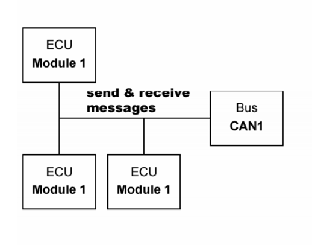  |   |
| CANalyzer |  | 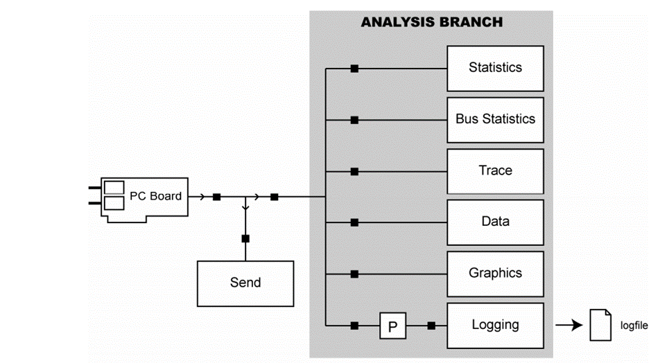 |

## Programming Environment

| CANoe     |      |
| --------- | ------------------------------------------------ |
| CANalyzer |  |

## Variables

### Scalar Data Types

#### Integers

* byte (unsigned, 1 Byte)
* word (unsigned, 2 Byte)
* dword (unsigned, 4 Byte)
* int (signed, 2 Byte)
* long (signed, 4 Byte)
* int64(signed, 8 Byte)
* qword(unsigned, 8 Byte)

#### Individual character

* char (1 Byte)

#### Floating point numbers

* float (8 Byte)
* double (8 Byte)

### Self Defined Structures(struct)

```c
variables
{
    struct PairStructType { int first; int second } pair;
    struct PairStructType pair2;
}
on start
{
    pair.first = 1;
    pair.second = 2;
}
```

### Enumeration Types(enum)

Enumeration types are defined in CAPL in exactly the same way as in C:
enum Colors { Red, Green, Blue };
Element names must be unique throughout the CAPL program.

### Associative Fields

With associative fields (so-called maps) you can perform a 1:1 assignment of values to other values without using excessive memory. The elements of an associative field are key value pairs, whereby there is fast access to a value via a key.
An associative field is declared in a similar way to a normal field but the data type of the key is written in square brackets:

```c
int m[float];         // maps floats to ints
float x[int64];       // maps int64s to floats
char[30] s[ char[] ]  // maps strings (of unspecified length) to strings of length < 30
```

Data types for the keys can be long, int64, float, double, enumeration types and char[]. As data type for values are simple data types, enumeration types fields and structure types allowed. You cannot use associative fields themselves as the value type of an associative field.

### Objects

* message and multiplexed_message
* diagRequest
* diagResponse
* signal
* sysVar, sysvarInt, sysvarFloat, sysvarString, sysvarIntArray, sysvarFloatArray, sysvarData
* Timer and msTimer

### Global Variables

* global variables are declared in the Variables section.
* The data types DWORD, LONG, WORD, INT, BYTE and CHAR can be used analogously to their use in the C programming language.
* The data types FLOAT and DOUBLE are synonyms and designate 64 bit floating point numbers conforming to the IEEE standard.
* A timer is created with a timer. The timer does not begin to run until it has been started in a on timer event procedure. After the timer has elapsed the associated event procedure is called. A variable of the type timer can only be accessed by the predefined functions setTimer and cancelTimer.
* CAN messages to be output by the CAPL program are declared with a message.
* Variables can be initialized in their declarations. Both simplified notation and bracketing with { } are permitted. The compiler initializes all variables, with the exception of timers, with default values (automatic default: 0).

### Local Variables

* Local variables are always created statically in CAPL (in contrast to C).
* This means that an initialization is only executed at the program start, and when variables enter the procedure they assume the value they had when they last left the procedure.

```c
variables
{
    int j, k = 2;
    double f = 17.5;
    msTimer tmr;
    message 100 msg;
    int array_var[2] = [1, 2];
    char name[12] = "hello world";
    int array_matrix[2][2] = {{1, 2}, {3, 4}};
}
```

## System Events

### on preStart

* Initialization of measurement (before start)
* The on preStart procedure is only used to initialize variables, to display messages in the Write Window and to read in data from files.
* At the moment the on preStart procedure is executed, not all possibilities of the system (CANoe) are available.
* It is not possible for example to send messages on the bus with the output function.

```c
on preStart
{
    write("hello from prestart");
}
```

### on start

* Program start

```c
on start
{
    write("hello from start");
}
```

### on preStop

* Measurement stop has been requested
* The on preStop handler is called after a measurement stop has been requested.
* The on preStop function can be used to carry out some final actions that must be done before the measurement stop actually takes effect.

```c
on preStop
{
    write("hello from preStop");
}
```

### on stopMeasurement

* End of measurement

```c
on stopMeasurement
{
    write("hello from stopMeasurement");
}
```

### on timer

* You can define time events in CAPL. When this event occurs, i.e. when a certain period of time elapses, the associated on timer procedure is called. You can program cyclic program sequences by resetting the same time event within the on timer procedure.
* The timer variable can be accessed with the keyword this within the event procedure.
* You would start a previously-defined timer with the function setTimer.
* After the timer has elapsed, the associated on timer procedure is called. The maximum time is 2147483647 s (=596523.23h) for variables of the type timer and 2147483647 ms (= 2147483,647 s = 596,52h) for variables of the type msTimer. With the function cancelTimer you can stop a timer which has already been started and thereby prevent the associated on timer procedure from being called.
* In CAPL exists the following variable types for timer:
  * timer - timer based on seconds
  * msTimer - timer based on milliseconds

```c
variables
{
    msTimer tmr;
    message 100 msg;
}

on key 'a'
{
    setTimer(tmr, 1000);
}

on timer tmr
{
    output(msg);
}
```

### on key

* With on key procedure you can execute defined actions with a key press.
  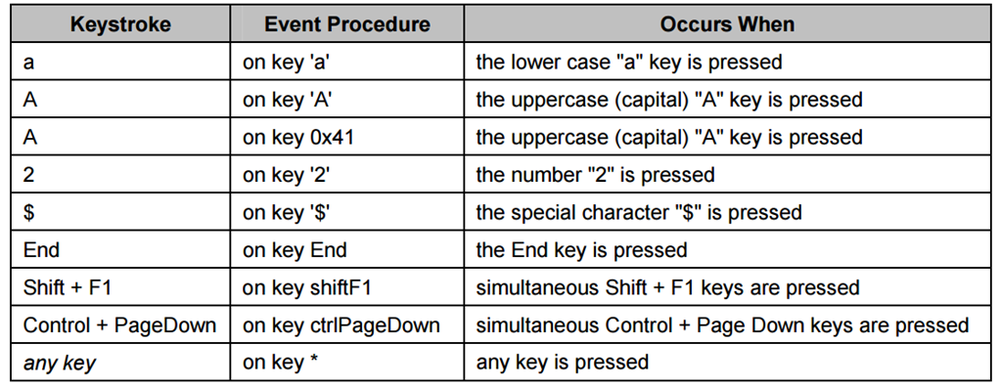

```c
on key 'a'
{
    message 100 msg;
    output(msg);
}
```

## Value Objects

### on signal

* called as soon as a signal changes.

```c
on signal LightSwitch::OnOff
{
    v1 = this.raw;
    v2 = $LightSwitch::OnOff.raw
}
```

### on signal_update

* called with every signal reception.

### on sysvar

* The event procedure type on sysVar is provided to react to value changes of system variables in CANoe.
* In contrast to messages, system variables are not blocked by CAPL nodes in a data flow branch of the measurement configuration.
* Therefore, when there are two CAPL nodes in series, both react to the same system variable with the event procedure on sysVar.

```c
on sysvar_update dummy::sys_var_1
{
  if(@this == 1)
  {
    output(msg_es);
  }
}
```

### on sysvar_update

* called with every system variable reception

## CAN events

### on message

* The event procedure on message is called on the receipt of a valid CAN message.
  
  
  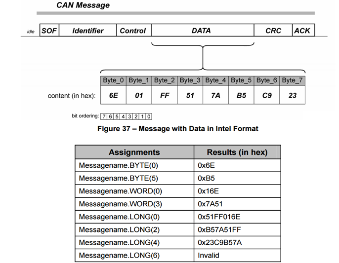

## user defined functions

```c
void dummy_user_func()
{
    int var_1 = 10;
    write("hello from user function. valr_1 = %d", var_1)
}
```

```c
void dummy_user_func_with_params(int var_1)
{
    write("hello from user function. valr_1 = %d", var_1)
}
```

```c
int dummy_user_func_with_params_and_return(int var_1)
{
    write("hello from user function. valr_1 = %d", var_1)
    return var_1*10
}
```

## "this" keyword

* Within an event procedure for receiving a CAN object or an environment variable, the data structure of the object is designated by the keyword **this**.
* The only event procedures that can use the **this** keyword are

```c
on message
on envVar
on key
on errorframe   // only to get the CAN channel number
on busOff
on errorPassive
on errorActive
on warningLimit
```

For example, you could access the first data byte of message 100 which was just received by means of the following

```c
on message 100
{
    byte byte_0;
    byte_0 = this.byte(0);
    write("byte 0 value = %d", byte_0);
}
```

Analogously, you could read the new value of the integer environment variable Switch which has just been changed by means of the following

```c
on envVar Switch
{
    int val;
    val = getValue(this);
}
```

## Control logging block using CAPL

The startLogging() and stopLogging() functions can be used to start and stop logging.

```c
on key 'a'
{
    startLogging();
    write("Logging Started");
}
```

```c
on key 'b'
{
    stopLogging();
    write("Logging Stopped");
}
```

## Using CAPL for testing

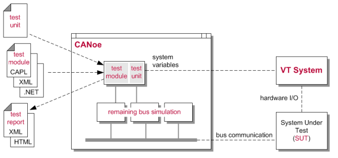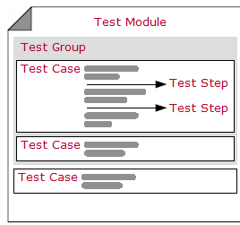
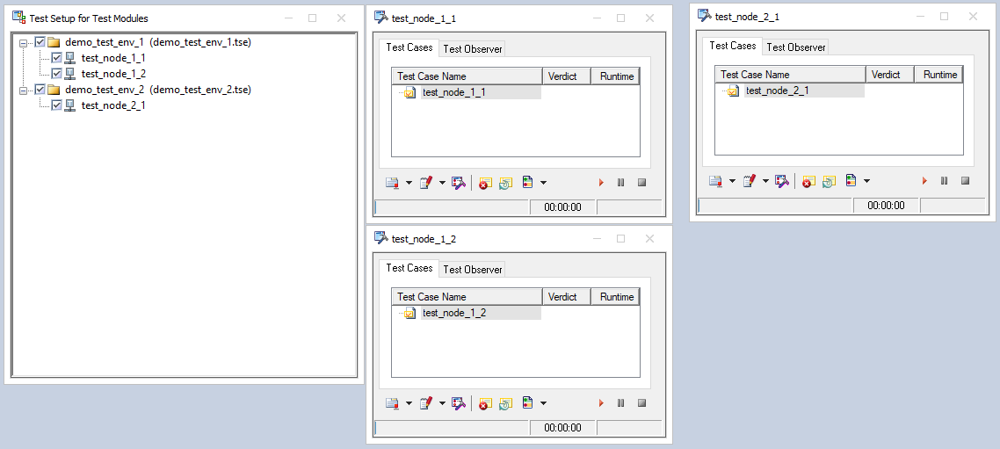

### Test Setup

* The user-defined test setup is displayed graphically in this window.
* All options for parameterizing the test environments are selected in this window.

### Test Environment

* All test environments are shown in a tree view in this window and can be configured there. Each root folder represents an independent test environment file. In CANoe there is exactly one Test Setup for Test Modules window in which several test environments can be loaded. A test environment consists of any directory structure that enables the grouping of test blocks.
* This window can be used to carry out the full range of actions, such as loading and saving, as well as creating new test environments. Right-click on the free window space and select the desired action from the context menu.
* Similarly, you can use the context menu of each respective object to carry out operations on individual test environments, folders or nodes in the test setup.
* Each test environment is stored in an individual file (*.TSE – Test Setup Environment) and can thus be loaded or unloaded independently of the CANoe configuration (simulation and analysis window).

### Test Module

* A test module contains a set of test cases that are executed sequentially by the test execution of CANoe or by its internal control program. Execution of a test module generates a test report.

### Test Case

* In a test case, a specific property of a system/unit (SUT) to be tested is tested. A test case has a clearly defined test task and returns a clear test result in the form of a verdict when it is executed.
* Test cases are only available if a test node linked in CANoe is concerned.

### Test Report

* The results from execution of a test module are recorded in a test report. A test report consists primarily of certain administrative information (such as the name of the test module, date of execution, etc.), information on the test cases executed and the results of the test. CANoe creates XML and HTML files to store test reports.
  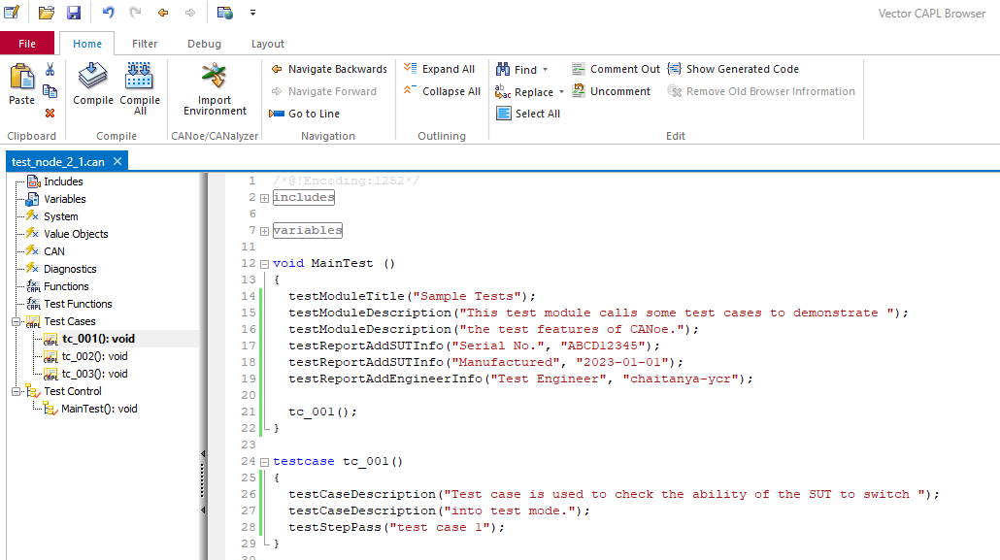

## **Examples based on use cases**

### **[How to send a message manually using a keyboard ?](examples/program_01.can)**


### **[How to send a message periodically ?](examples/program_02.can)**

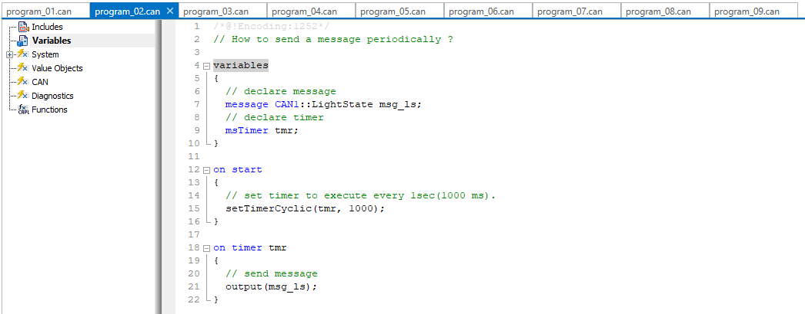

### **[How to send a message based on a system event ?](examples/program_03.can)**

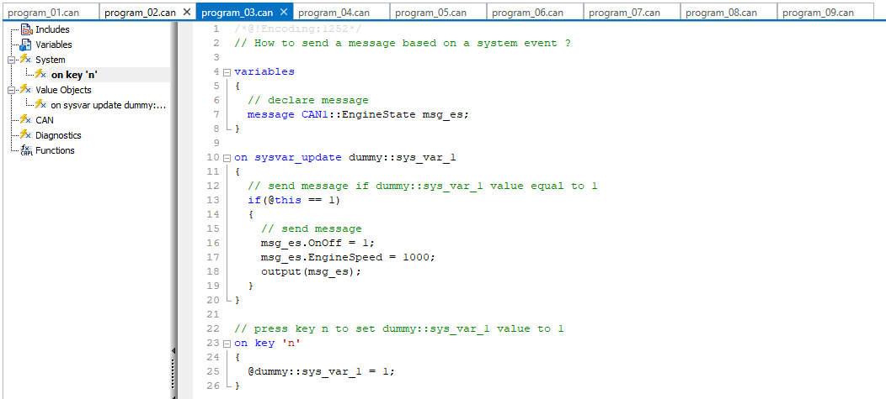

### **[How to act and react based on the graphic panel inputs ?](examples/program_04.can)**


### **[How to create a test case to check if a signal value is valid ?](examples/program_05.can)**

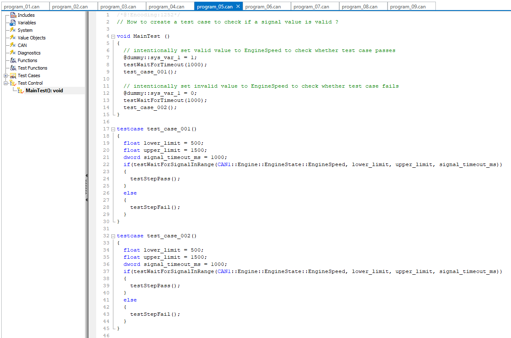

### **[How to send a diagnostic message ?](examples/program_06.can)**

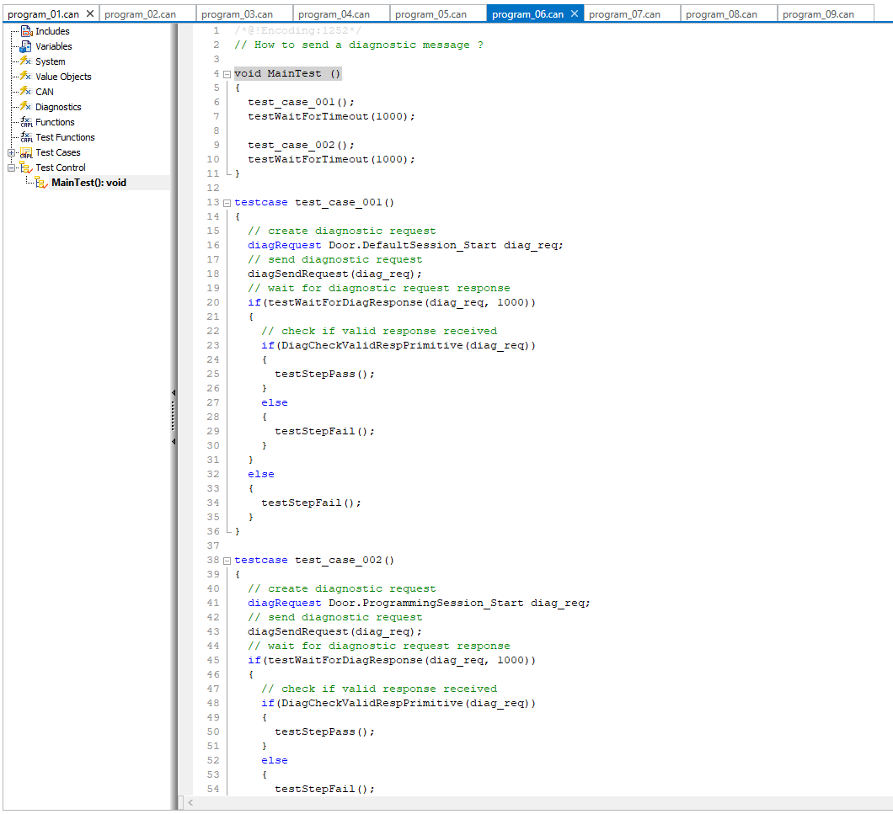

### **[How to validate diagnostic messages ?](examples/program_07.can)**

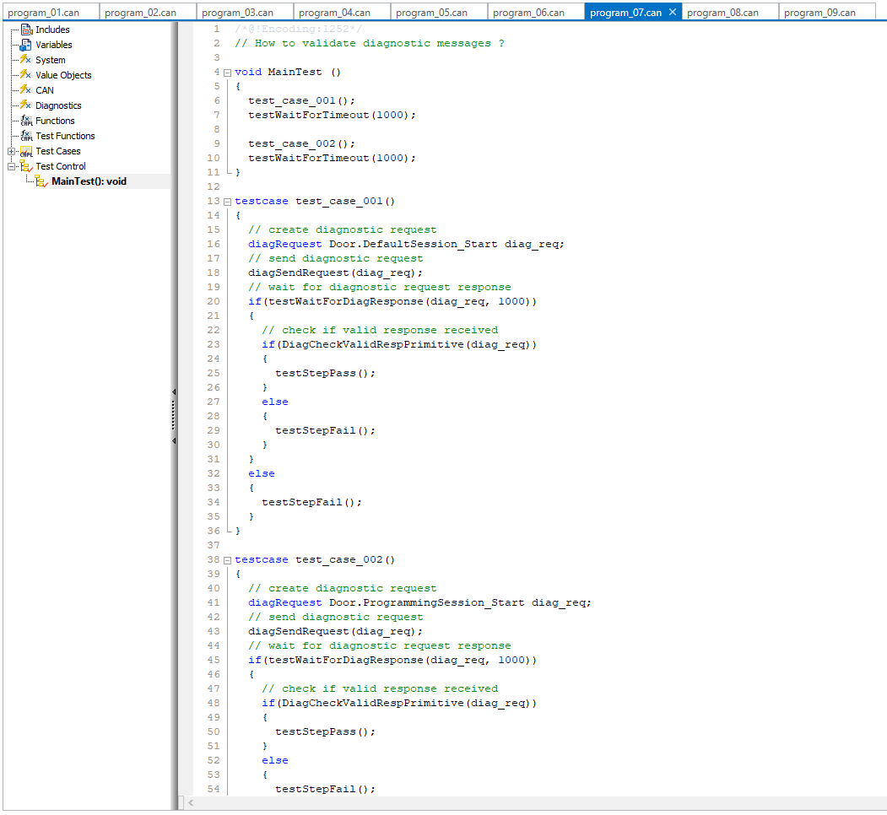

### **[How to capture a graphic window screenshot and insert it in a report ?](examples/program_08.can)**

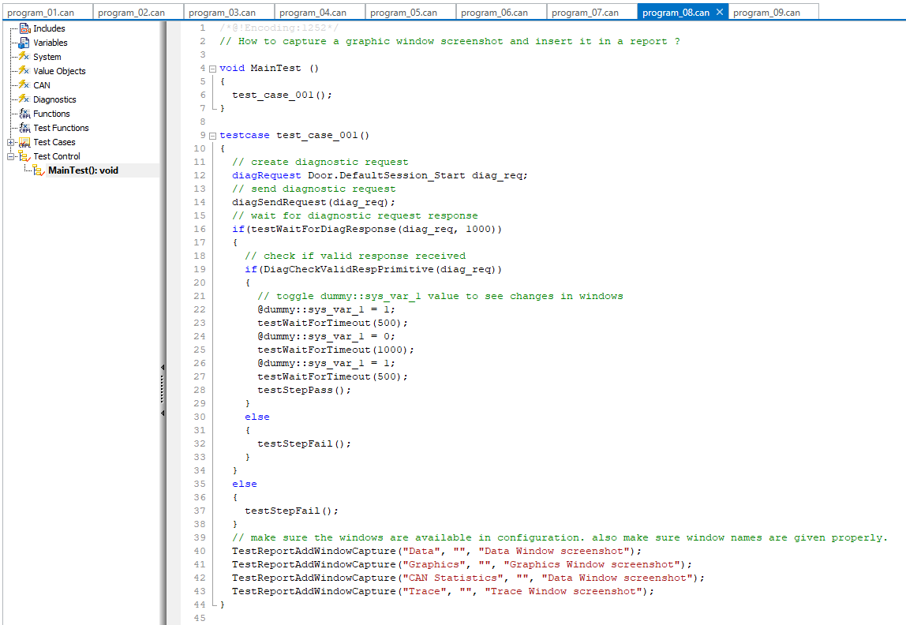

### **[How to execute windows programs from a CAPL program ?](examples/program_09.can)**

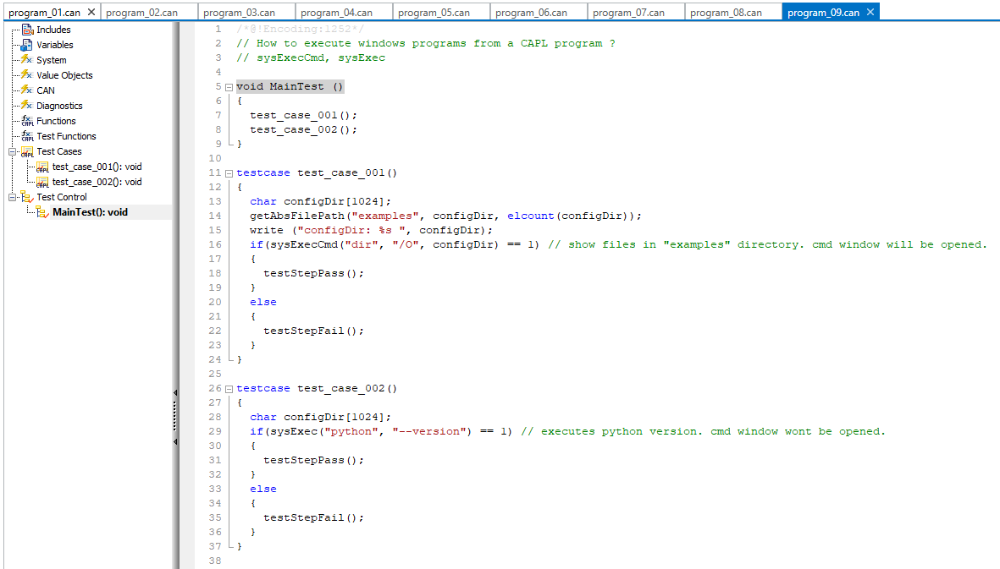
